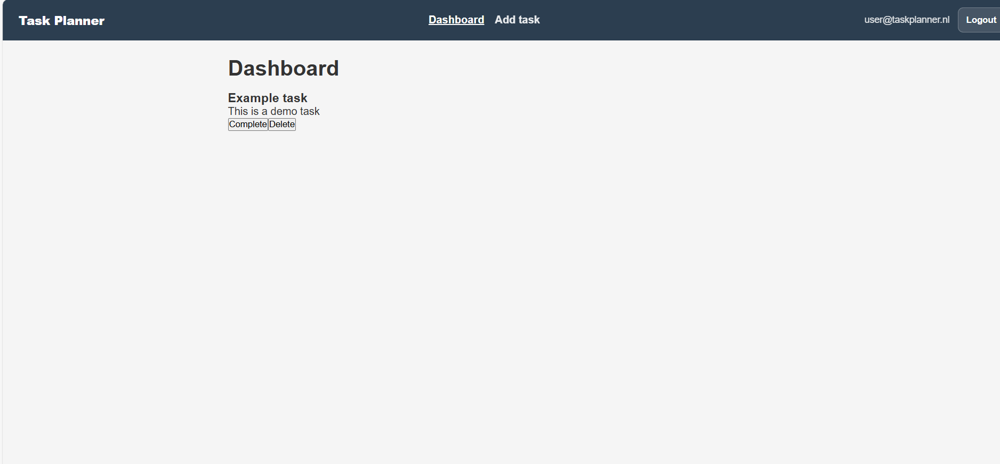

#  Task Planner

## Inleiding
De  Task Planner is een frontend webapplicatie gebouwd met React.
De applicatie stelt gebruikers in staat om zich te registreren, in te loggen en hun persoonlijke taken te beheren via een overzichtelijk dashboard.

Deze applicatie is ontwikkeld als eindopdracht voor de leerlijn Frontend (HTML, CSS, JavaScript en React) en communiceert met een externe API voor authenticatie en dataverwerking.

### Belangrijkste functionaliteiten
- Registreren en inloggen van gebruikers
- Beveiligde routes (alleen toegankelijk na inloggen)
- Overzicht van taken in een dashboard
- Taken toevoegen
- Taken markeren als voltooid
- Taken verwijderen

---

## Screenshot
Plaats een screenshot van de applicatie (bijvoorbeeld het dashboard) in de map `screenshots` in de root van het project.

Voorbeeld:
`screenshots/dashboard.png`



---

## Benodigdheden
Om deze applicatie lokaal te kunnen draaien heb je het volgende nodig:

- Node.js (versie 18 of hoger)
- npm (meegeleverd met Node.js)
- Een moderne browser (Chrome, Edge of Firefox)

---

## De applicatie lokaal draaien

### 1. Installatie
Clone of download dit project en ga naar de root van de projectmap.

```bash
npm install
```

### 2. Configuratie
De applicatie maakt gebruik van de NOVI Dynamic API voor authenticatie en dataverwerking.

Maak in de root van het project een `.env` bestand aan met de volgende variabelen:

```env
VITE_API_URL=https://novi-backend-api-wgsgz.ondigitalocean.app
VITE_API_KEY=9e4b764b-84ae-48ce-ad5c-c67d45fc1b7a
```

Belangrijk:
- De API key wordt door de ontwikkelaar aangeleverd
- De docent hoeft geen eigen API key aan te maken
- Het `.env` bestand wordt niet gecommit naar GitHub

### 3. Applicatie starten
Start de development server met:

```bash
npm run dev
```

De applicatie is vervolgens beschikbaar op:

```
http://localhost:5173
```

---

## Testgebruikers
Indien er testaccounts beschikbaar zijn, kan er worden ingelogd met:

- E-mail: user@taskplanner.nl
- Wachtwoord: user123

(Pas deze gegevens aan indien nodig)

---

## Overige npm-commando’s

```bash
npm run build
```
Bouwt een productieversie van de applicatie.

```bash
npm run preview
```
Start een lokale server om de productiebuild te bekijken.

---

## Gebruikte technieken
- React
- React Router
- React Context API
- JavaScript (ES6+)
- HTML5 (semantisch)
- CSS (custom styling met Flexbox)
- Vite
- NOVI Dynamic API
- Git & GitHub

---

## Projectstructuur

```
src/
 ├─ api/
 ├─ components/
 ├─ Layout/
 ├─ Task/
 ├─ Context/
 ├─ Pages/
 ├─ Routes/
 ├─ Styles/
 ├─ App.jsx
 └─ main.jsx
```

---

## Auteur
Farwa Rafique  
Eindopdracht Frontend – NOVI Hogeschool

